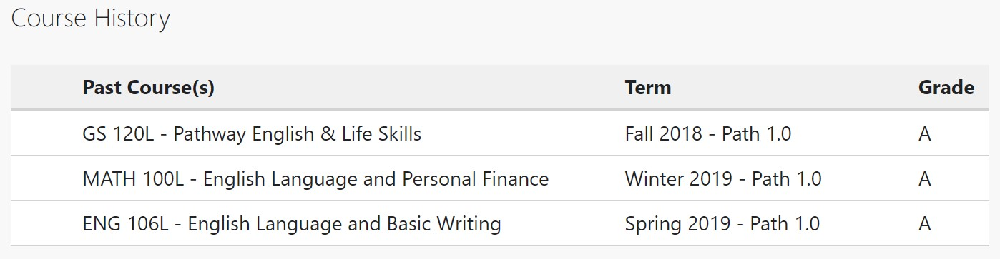

# Kabaloev Oleg
---
### Contact information:
 * Phone: +79292572704
 * Email: okooba1@gmail.com
 * Discord: @okooba
---
### Professional profile
#### My strong qualities are diligence, hard work, and perseverance. I believe that there are no unsolvable problems, and that a combination of diligence, a clear mind, and confidence in one's own abilities can lead to solutions for even the most complex tasks. In work, the most important things for me are a professional approach and process optimization.
---
### Skills
* HTML, CSS, Markdown
* JavaScript, Python
* VS Code
* Git/Github
 ---
 
 
 ### Code examples 
```
function FootWear() {
let text = document.getElementById('inputBox').value;
let weather = parseInt(text);
let Foot;
if (weather == "hot") {
Foot = sandals;
} 
else if (weather == "rain") { 
Foot = galoshes;
} 
else if (weather == "snow") {
Foot ="boots";
} 
else { 
Foot = "shoes";
} 
document.getElementById('output').innerHTML = Foot;
} 
</script> 
```


### Programming experience
#### I completed two programming courses at Brigham Young University-Idaho: the first course covered the basics of frontend development, some projects using HTML CSS and Javascript, and the second course covered the basics of backend development, I learned the basics of Python.
### Education 
* National University of Science and Technology MISiS, Moscow, Russia
    + Master Degree in Civil engineering 
* Brigham Young University-Idaho, USA:
    + CS 101: Introduction to Programming
    + CIT 160: Introduction to Programming
### Languages 
#### English - B2 BYU Pathway Program git 

#### Russian - native speaker 
#### German - B1 
